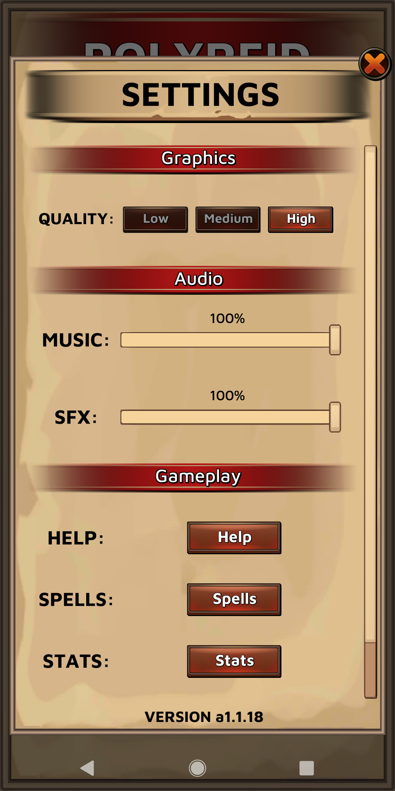
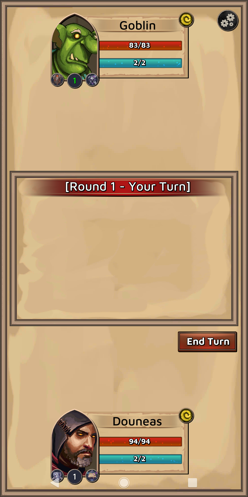

# <i>Main Menu.</i>

# <i>Settings (saves data via JSON.)</i>

# <i>In-Game</i>

# <i>Show Spells (tap on Portrait)</i>

# <i>Attributes (Stats)</i>

# <i>Spell Information (hold down Spell button)</i>

# <i>Use Spell</i>

